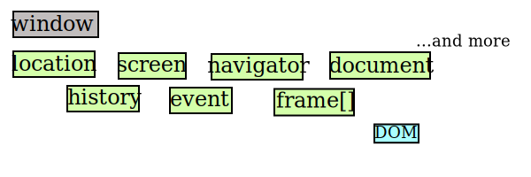

Learn JS properly
===

# The Browser Object Model(BOM)
# Beginning JavaScript - Chapter 8 Programing the Browser
- Working with the browser's native window object
- Sending the browser to the URL
- Manipulation images
- Retrieving the browser's geo location
- Detecting the user's browser

## The "Browser" as Object
We already know `alert()` and `prompt()` methods of the **window** object.  
We also used the `write()` method of the **document** object.  
Since different browsers have different BOM properties or objects. It's better sticking to the core functionality of the BOM, to avoid compatibility problems among different browsers.  
The BOM has a hierarchy:(Shown as the diagrame below)
  
We will learn about the **DOM** objects latter.  
Notice that they are all used in **lowercase**.  

## The "window" object
- The "window" object represent all that's contain in the browser.   
- It's a *global object*, which means we don't need to call it to use its properties and methods. And all *global* functions ad variables are automaticly assigne to the "window" object.  
For example, the `alert()` function is a method of the window object, it can be called by typing `window.alert()`, but normaly we just type `alert()`.  
- Don't use the names for custom functions or variables that conflict with BOM objects. Ex: history, navigator, screen, location, document... etc.  

### The "history" Object
- It keeps track of the pages that the user visits.  The list of pages is called the **history stack**.
- `history.length` to find out how many pages are in the **history stack**.
- `history.back()` and `history.forward()` methods, they work like the "back" and "forward" button in the browser.
- `history.go()` can move further then he next/last page. Just pass in how many pages you want to move as the parameter:  
`history.go(-2);` this will take you to the page befor the previous page.  
`history.go(1);` === `history.forward()` and `history.go(-1);` === `history.back()`

### The "location" Object
- It contains not only the "uniform resource locator(URL)"(`href`), but also the server hosting the page(`hostname`), the port number of the server connection(`port`), and the protocol used(`protocol`).  

# (From Itunes U)Advanced Topics in Web Development
## The Browser Object Model
Use JavaScript to control the browser, but not the web page, whitch is control by the Document Object Model.  
Ex: `alert()` and `prompt()` are methods for **windows** object inside the BOM.  
check out http://www.javascriptkit.com/jsref/window.shtml

1. Window dimensions
2. Window opening

